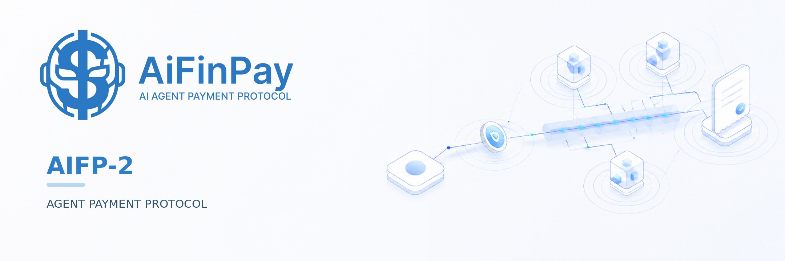
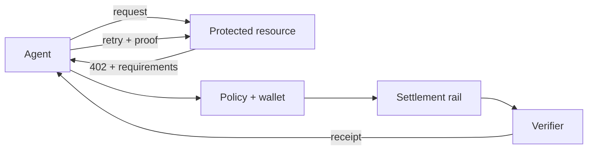
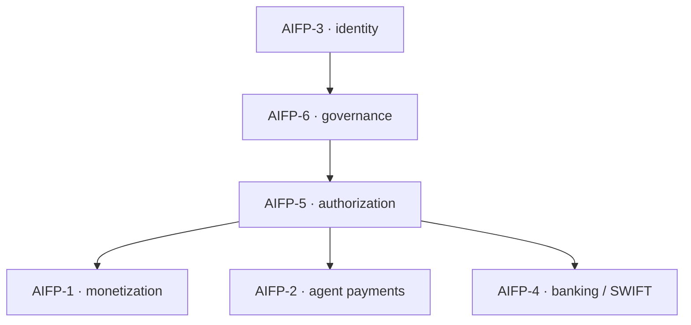

<p align="center">
  
</p>

<h1 align="center">AiFinPay AIFP-2 Protocol</h1>

<p align="center">
  <strong>Programmable, x402-compatible payments for autonomous agents, APIs, MCP tools and digital services.</strong>
</p>

<p align="center">
  <a href="docs/index.md"></a>
  <a href="docs/protocol-specification.md"></a>
  <a href="LICENSE"></a>
  <a href="ROADMAP.md"></a>
</p>

<p align="center">
  <a href="https://aifinpay.io">Website</a> ·
  <a href="docs/index.md">Documentation</a> ·
  <a href="https://github.com/AiFinPay/sdk">SDK &amp; MCP</a> ·
  <a href="https://mcp.aifinpay.io/mcp">MCP endpoint</a>
</p>

---

## Payment infrastructure for the agentic web

AIFP-2 defines how an autonomous agent discovers a price, evaluates a machine-readable payment requirement, authorizes settlement under its spending policy, pays through an approved rail, presents proof and receives a verifiable result.

It is AiFinPay's payment-execution protocol. It supports the open HTTP `402 Payment Required` pattern and an x402 v2 compatibility profile without making any single facilitator, wallet provider or blockchain mandatory.



## AIFP-2 in one request loop

```text
request protected resource
→ receive HTTP 402 and accepted payment options
→ choose network and asset under agent policy
→ bind payment to resource, amount, payee, nonce and expiry
→ sign locally; private keys never leave the wallet boundary
→ verify and settle through the selected route
→ receive a signed, replay-resistant receipt
→ retry the original request with payment proof
→ receive the protected result
```

## Current economics

| Route | Merchant/provider amount | AiFinPay protocol fee | Creator/referral fee |
|---|---:|---:|---:|
| **AIFP-2 with x402-compatible execution** | Provider-defined | **0% / 0 bps** | **0% / 0 bps** |
| **AIFP-1 monetization** | Published action price | **1% / 100 bps, gross-inclusive** | 0% |

AIFP-2 must not silently fall back to AIFP-1 economics. Route class and fee profile are bound into the quote, transaction plan and receipt.

## x402 v2 compatibility

The compatibility profile uses the standard v2 headers:

| Header | Direction | Purpose |
|---|---|---|
| `PAYMENT-REQUIRED` | resource → client | Base64-encoded payment requirements |
| `PAYMENT-SIGNATURE` | client → resource | Base64-encoded signed payment payload |
| `PAYMENT-RESPONSE` | resource → client | Base64-encoded verification/settlement result |

The current EVM profile uses CAIP-2 network identifiers and EIP-3009 `TransferWithAuthorization` where supported. Legacy x402 v1 `X-PAYMENT` headers are not the canonical profile. See [x402 compatibility](docs/x402-compatibility.md).

## Network surfaces

<table align="center">
  <tr>
    <td align="center"><br /><sub>Polygon</sub></td>
    <td align="center"><br /><sub>Avalanche</sub></td>
    <td align="center"><br /><sub>BNB Chain</sub></td>
    <td align="center"><br /><sub>Optimism</sub></td>
    <td align="center"><br /><sub>Solana</sub></td>
    <td align="center"><br /><sub>NEAR</sub></td>
  </tr>
</table>

The implementation program spans thirteen network surfaces: nine EVM networks plus Solana, NEAR, Aptos and Casper. Status is tracked per route; the number of network adapters or historical deployments does not imply feature parity or global production activation. See the [network matrix](docs/network-matrix.md) and [deployment evidence rules](docs/deployment-evidence.md).

## Core security invariants

1. The wallet signs locally; APIs never receive a private key or recovery phrase.
2. A client-supplied transaction hash is not sufficient evidence of payment.
3. Network, asset, payee, amount, expiry, resource scope and payment identifier are bound before signing.
4. Amounts use integer atomic units with independently verified asset decimals.
5. Duplicate payment identifiers, receipts and settlement consumption fail closed.
6. A route is not advertised as payable unless the active verifier can validate it.
7. AIFP-2 economics are exactly `0/0`; cross-route or stale-contract fallback fails closed.
8. Deployment addresses and runtime hashes are independently pinned before the wallet signs.

## Documentation

| Start here | Document |
|---|---|
| Protocol behavior | [Normative specification](docs/protocol-specification.md) |
| System boundaries | [Architecture](docs/architecture.md) |
| HTTP and x402 | [x402 compatibility](docs/x402-compatibility.md) |
| Networks and current status | [Network matrix](docs/network-matrix.md) |
| SDK, MCP and server integration | [Integration guide](docs/integration-guide.md) |
| Threats and required controls | [Security model](docs/security-model.md) |
| Evidence required before activation | [Deployment evidence](docs/deployment-evidence.md) |
| Code ownership and real implementation status | [Implementation map](docs/implementation-map.md) |
| Machine-readable API | [OpenAPI 3.1](spec/openapi.yaml) |
| Machine-readable objects | [JSON Schemas](schemas/) |

## Repository and implementation status

This repository is the public protocol, schema and integration contract for AIFP-2. It does not make an unverified deployment production-ready.

Current implementation work is split across several repositories:

- [Agent SDK and MCP](https://github.com/AiFinPay/sdk)
- [EVM contracts](https://github.com/AiFinPay/evm-contract)
- [Solana program](https://github.com/AiFinPay/solana-contract)
- [Stellar x402 facilitator](https://github.com/AiFinPay/stellar-x402-facilitator)
- [Casper contract](https://github.com/AiFinPay/casper-contract)
- [AiFinPay web/backend](https://github.com/AiFinPay/aifinpay-web)

The SDK `main` branch contains the x402 v2 EVM transport/profile, its named regression tests and the merged SDK/MCP settlement RC from PR #26. The 13-network backend control plane remains an open stacked source RC in `aifinpay-web` PR #22. Canonical settlement contract candidates remain open in EVM PR #9, Solana PR #4 and Casper PR #13. These are component/source milestones, not proof that the complete payment system is production-live. See the [implementation map](docs/implementation-map.md).

Production activation requires at least one canonical route to pass contract, SDK, backend, verifier, receipt, ledger/indexer and protected-resource E2E acceptance.

## One system, six protocols

See the complete [AiFinPay protocol-family architecture](docs/protocol-family.md).



| Protocol | Responsibility |
|---|---|
| [AIFP-1](https://github.com/AiFinPay/AIFP-1) | Monetizes AI-agent access to merchant resources |
| **AIFP-2** | Executes programmable agent and machine-to-machine payments |
| [AIFP-3](https://github.com/AiFinPay/AIFP-3) | Portable agent identity, wallet bindings and status |
| [AIFP-4](https://github.com/AiFinPay/AIFP-4) | Connects approved agent instructions to banking and SWIFT rails |
| [AIFP-5](https://github.com/AiFinPay/AIFP-5-Quantum-Safe-Financial-Protocol)¹ | Provides classical, hybrid and post-quantum authorization profiles |
| [AIFP-6](https://github.com/AiFinPay/AIFP-6-Agentic-Financial-Governance-Protocol)¹ | Applies organizational policy, delegation, approvals and audit rules |

Each layer can be adopted independently. AIFP-3 is not required for baseline x402 interoperability; when present, it provides stronger identity and policy binding.

¹ AIFP-5 and AIFP-6 are currently private repositories; the links resolve for authorized organization members.

## License

Code, examples, schemas and machine-readable artifacts are licensed under Apache License 2.0. Documentation and prose specifications are licensed under CC BY 4.0 unless a file states otherwise. See [LICENSE](LICENSE) and [NOTICE](NOTICE).
