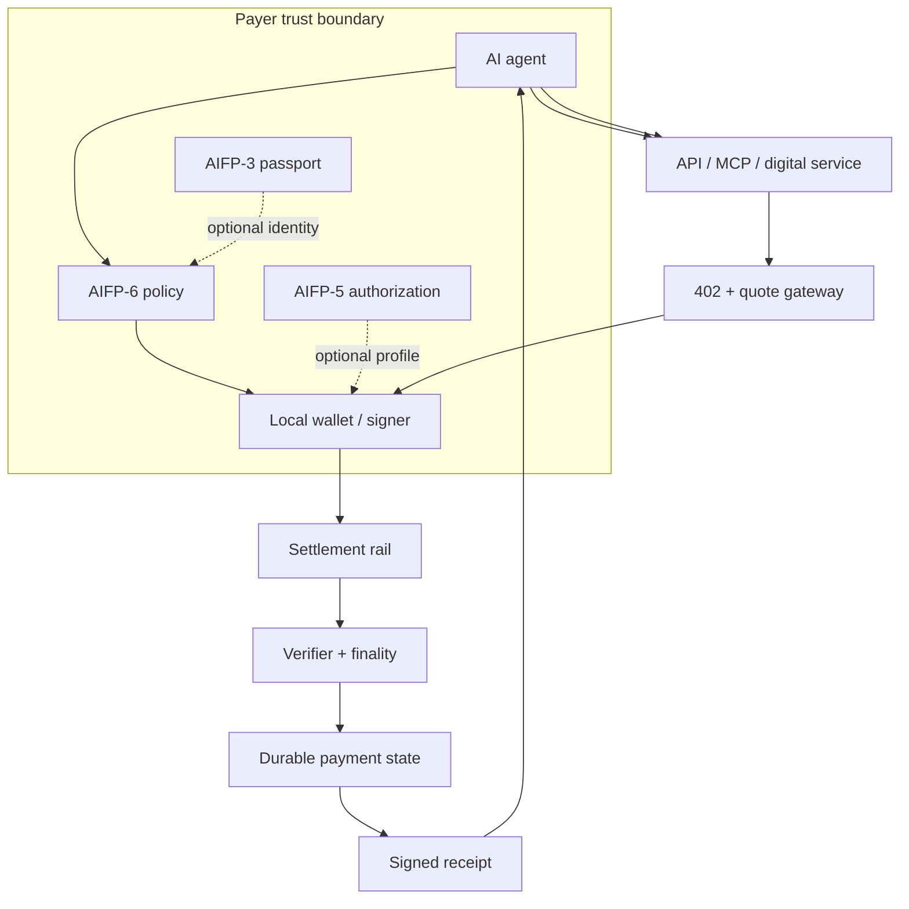
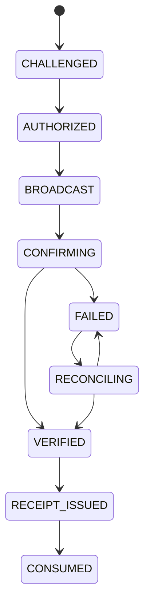

# Architecture

## Components

| Component | Owns | Must not own |
|---|---|---|
| Resource server | access decision, price reference, receipt validation | payer key |
| Quote gateway | accepted routes, immutable transaction plan | authority to change wallet policy |
| Wallet | local keys, policy enforcement, signature | server-side custody by default |
| Contract/program | deterministic settlement, replay guard, events | HTTP access decision |
| Verifier | chain semantics and finality | trust a client hash blindly |
| Ledger/indexer | durable state, reconciliation, evidence | redefine on-chain outcome |
| Receipt service | signed access proof | issue before verification |

## State machine

Financial state transitions require durable idempotency and append-only evidence. Redis or an in-memory cache alone is not a canonical financial ledger.

