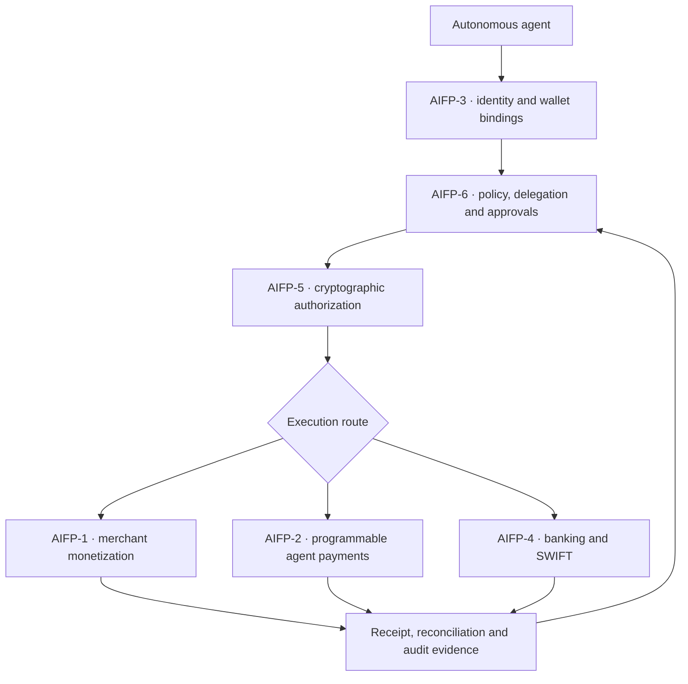

# AiFinPay Protocol Family

AiFinPay is one financial infrastructure stack for autonomous agents. The six protocols have separate responsibilities so identity, policy, authorization and execution can evolve without collapsing into one monolith.

## Canonical architecture

## Responsibility map

| Protocol | Canonical responsibility | Economics / authority | Current maturity |
|---|---|---|---|
| [AIFP-1](https://github.com/AiFinPay/AIFP-1) | Monetizes AI-agent access to websites, APIs, MCP tools, data and digital actions | Published action price; 1% AiFinPay fee gross-inclusive; creator 0% | Draft protocol with implementation work; route evidence required |
| [AIFP-2](https://github.com/AiFinPay/AIFP-2) | Executes programmable agent and machine-to-machine payments; provides an x402 v2 compatibility profile | Provider-defined price; current AiFinPay fee 0%; creator 0% | Draft protocol and source candidates; production activation gated |
| [AIFP-3](https://github.com/AiFinPay/AIFP-3) | Portable Agent Passport: identity, holder/issuer keys, status, permissions, reputation and multi-wallet bindings | Identity and permission layer; no payment fee | vNext implementation candidate; chain migration and E2E pending |
| [AIFP-4](https://github.com/AiFinPay/AIFP-4) | Connects approved agent instructions to banking, treasury and SWIFT rails through appropriate licensed providers | Organization policy and provider terms | Draft/reference foundation; live corridors require partners and approvals |
| [AIFP-5](https://github.com/AiFinPay/AIFP-5-Quantum-Safe-Financial-Protocol)¹ | Adds crypto-agile classical, hybrid and post-quantum authorization profiles | Security mode: `CLASSICAL_ONLY`, `HYBRID_REQUIRED`, `PQ_ONLY` | Private draft/reference implementation; no production deployment |
| [AIFP-6](https://github.com/AiFinPay/AIFP-6-Agentic-Financial-Governance-Protocol)¹ | Applies machine-readable authority, limits, delegation, approvals, emergency controls and audit rules | Returns `ALLOW`, `DENY` or `REQUIRE_APPROVAL` | Private draft/reference policy engine; no production service |

## Boundaries

- HTTP `402 Payment Required` is a shared web primitive, not the identity of one AiFinPay protocol.
- AIFP-1 owns merchant monetization, access pricing and 1% merchant-route economics.
- AIFP-2 owns programmable payment execution and exposes an x402-compatible profile; x402 remains an open external standard.
- AIFP-3 identifies the agent and its wallets but does not execute a payment.
- AIFP-6 decides whether an action is allowed; AIFP-5 proves the authorization; AIFP-1, AIFP-2 or AIFP-4 executes it.
- A protocol specification, reference implementation and production-live route are separate status claims.

¹ AIFP-5 and AIFP-6 links require authorized organization access while those repositories remain private.

## Shared invariants

1. Private keys stay inside the holder or wallet trust boundary.
2. Identity, policy, authorization and execution use domain-separated signatures.
3. Every financial action binds actor, scope, amount, asset, destination, expiry and replay state.
4. Unknown status, stale evidence or ambiguous route identity fails closed.
5. Receipts are issued after authoritative verification.
6. Production claims require reproducible artifacts, independent review and real E2E evidence.
